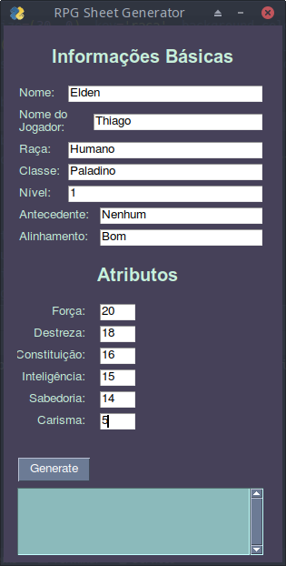
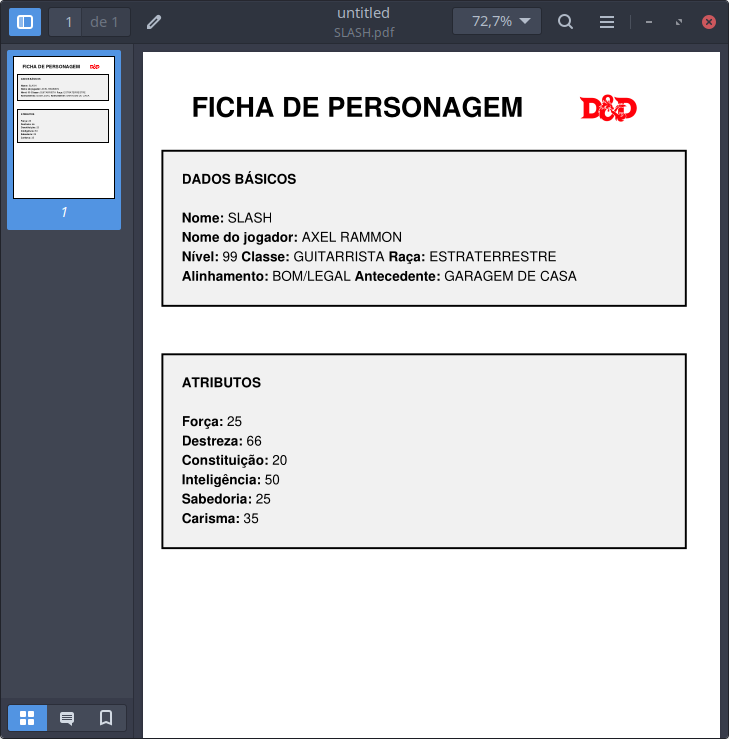

# RPGSheePDFGenerator

Simples gerador de ficha de personagem de RPG em PDF escrito em python utilizando as bibliotecas PySimpleGUI e reportlab

Interface do usuário para inserção dos dados

Arquivo PDF gerado
